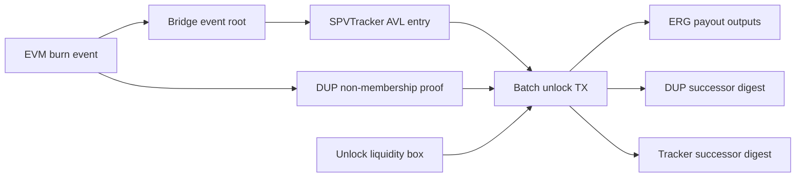

# EVM Sidechain Integration Checklist

This checklist is for teams that already know Solidity, Frontier, Substrate, bridges, or rollups and want to evaluate this prototype as a future Ergo settlement kit.

The goal is not to make EVM developers become ErgoScript experts. The goal is to show which parts are already packaged, which knobs they must choose, and where Ergo's eUTXO model gives them a different scaling surface.

The current legacy V1 contracts and transaction builders are diagnostic and
compatibility material, not an activatable live-settlement package. New V1
signing, authorization, submission, and broadcast routes are physically absent
because the legacy payout equation deducts the miner fee from protected backing.

## What You Can Reuse

| Layer | Copy or adapt | Why it exists |
| --- | --- | --- |
| Solidity app layer | `solidity/SERG.sol`, `solidity/ErgoBridge.sol` | Familiar ERC-20 mint/burn and peg-out event surface |
| Sidechain runtime | Frontier/Substrate dev chain shape | Keep the EVM execution environment familiar |
| Event commitment | Burn event root derivation | Turns an EVM burn into a compact settlement commitment |
| Ergo tracker | `SPVTracker.es` + `spv-tracker.ts` | Commits sidechain block/event roots into an AVL tree |
| Replay protection | `DoubleUnlockPreventionAggregateBatch.es` | Prevents the same burn from settling twice |
| Batch settlement | `MainChainAggregateUnlockBatch.es` | Historical diagnostic profile for studying multi-exit transaction shape |
| Proof generation | `avl-bridge.ts`, WASM AVL package | Builds lookup/insert proofs off-chain |
| TX assembly | `aggregate-settlement-builder.ts`, `aggregate-settlement-tx.ts` | Hides context-extension packing and output layout |
| Operator loop | `aggregate-settlement-service.ts`, `relayer-daemon.ts` | Builds/checks diagnostics, holds new burns fail-closed, and reconciles exact historical submissions |
| API reference | `docs/contract-relayer-api-reference.md` | Maps contract registers, Var slots, relayer entrypoints, and invariants |
| Showcase | `npm run showcase` | Offline proof/benchmark/finality demo for stakeholders |

## Decisions Before You Fork

| Decision | Prototype default | Production question |
| --- | --- | --- |
| Sidechain execution | Substrate/Frontier EVM | Keep Frontier, or use another VM/runtime? |
| Trust model | Relayer/committee roadmap | Committee multisig first, then SPV relay? |
| Finality depth | Configured ordering-block depth | How much reorg risk is acceptable? |
| Fast UX | Subblock-ready monitoring model | Which UI states unlock before finality? |
| Batch size | 10 claims per unlock TX | Optimize for contract size, fees, and latency |
| Batch window | Operator policy | Wait for more claims or settle quickly? |
| Liquidity model | Unlock liquidity boxes | One vault, many lanes, or operator buckets? |
| DUP sharding | Design note only | How many replay-protection shards? |
| Tracker model | Global SPVTracker today | Pre-ingest entries, shard tracker, or keep same-TX ingest? |
| Fee policy | Prototype constants | Who pays L1 settlement and operator fees? |

## EVM To Ergo Glossary

| If you think in EVM terms | In this prototype, look for | Practical meaning |
| --- | --- | --- |
| Contract storage slot | Box register `R4..R9` | Typed state stored directly in a UTXO |
| Contract address identity | Singleton NFT | State-machine identity follows a token |
| Calldata | Context extension Vars | Per-input proof data for a transaction |
| Static call / view read | DataInput | Read a box without spending it |
| Mapping root | AVL digest | Compact commitment to a large set |
| Mapping non-inclusion proof | DUP lookup proof | Proves a burn ID is not spent yet |
| Mapping update proof | DUP insert proof | Proves replay state advanced correctly |
| Event receipt proof | Tracker get proof | Proves a sidechain event root is anchored |
| Batch withdrawal | Aggregate unlock TX | Many payouts, one replay-state transition |
| Sharded contract state | Sharded boxes | Independent inputs can be spent in parallel |

## Settlement State Flow

The EVM team mostly works on the left side: burn events, event roots, and sidechain block data. The kit handles the right side: AVL proofs, singleton boxes, context extensions, and Ergo output layout.

## Minimal Integration Path

1. Pick a stable sidechain ID.
2. Keep or adapt the Solidity burn event format.
3. Implement the same event-root derivation in your sidechain indexer.
4. Review [Contract And Relayer API Reference](contract-relayer-api-reference.md)
   before changing register layouts, Var slots, or output ordering.
5. Review the historical SPVTracker, DUP batch, and unlock batch contracts; do
   not deploy them as a new funds-authority route.
6. Configure only an isolated offline diagnostic environment. Keep
   `BRIDGE_BROADCAST_ENABLED=false`; `AGGREGATE_BATCH_ENABLED` can select a demo
   shape but cannot enable a new submission path.
7. Run `npm run showcase` to verify the mental model offline.
8. Use non-broadcast `prepare*` and `check*` commands only to inspect transaction
   shape, DUP successor, payouts, and tracker state. A live path requires a
   separately versioned external-fee profile, on-chain authority cutover,
   global replay lineage, and exact target-node acceptance.
9. Decide the next hardening step:
   - on-chain committee multisig,
   - SPV relay/trustless proof path,
   - sharded DUP/liquidity lanes,
   - subblock-aware monitoring.

## What Not To Change First

Avoid changing these before the basic demo is green:

- context extension Var layout,
- claim-core byte packing,
- AVL key/value lengths,
- singleton NFT preservation,
- output ordering in batch settlement,
- local WASM signing surface.

These are the parts that make the Ergo side work. Change the EVM event schema and operator policy first; change the proof plumbing only after tests and spikes are extended.

## Acceptance Checklist

A fork is ready for a serious prototype demo when:

- `npm run showcase` runs offline and explains the proof model.
- `npm run contracts:check` compiles all Ergo contracts.
- `npm test` passes without node wallet signing.
- A single claim settles on testnet.
- A 2 to 10 claim batch settles on testnet.
- Live settlement signing is unblocked (`npm run demo:readiness` shows PASS on "Live settlement signing").
- Missing NFT, duplicate burn, wrong payout, and wrong DUP digest are rejected.
- The UI distinguishes fast inclusion from economic finality.
- The README states the trust model honestly.
