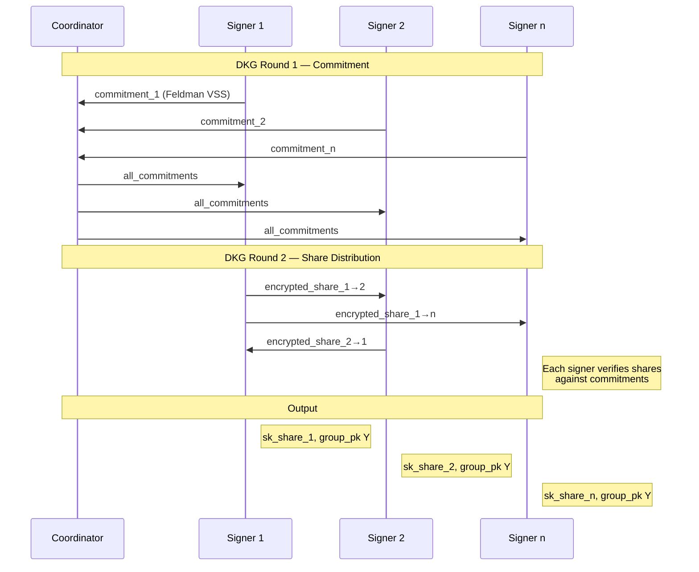

# ~~Phase 010~~ Phase 015 — FROST/MPC Threshold Signing Architecture (ARCHIVED RESEARCH)

> **Status**: Research Complete — **DECISION LOCKED: Option D (On-Chain Multisig)**
> **Date**: 2026-05-05
> **Prerequisite**: Phase 006 ✅ (WASM hybrid signer via ergo-lib-wasm-nodejs — single signing entry point)
> **Decision**: `atLeast(13, Coll(pk1...pk20))` on-chain multisig (Rosen Bridge pattern)
> **FROST**: Deferred to Phase 015 (distant optimization, 100+ validators)
> **Rationale**: Don't roll your own crypto. Rosen Bridge secures tens of millions with this exact primitive. 1-2 days vs 1 month. 728 bytes/TX is <1% of 96KB block limit.

---

## 1. Executive Summary

> [!WARNING]
> **ARCHIVED DOCUMENT**: Phase 010a uses `atLeast(m, Coll(pk1..pkN))` on-chain multisig (Rosen Bridge pattern). FROST is deferred to Phase 015 and is NOT the current implementation path. This document is preserved as research reference only.
> Implementation and API names below describe the 2026-05 research snapshot;
> current runtime boundaries are defined by the bridge execution plan.

The Ergo-Substrate bridge currently relies on a **single relayer private key** for all on-chain operations. Compromise of this key equals 100% TVL drain. ~~Phase 010 replaces the single signer with a FROST committee~~ **Phase 010a** uses native ErgoScript `atLeast(m, Coll(pk1..pkN))` on-chain multisig. The FROST research below remains valid for a future Phase 015 optimization if 100+ validators are needed.

### Key Architectural Insight

FROST produces a standard Schnorr signature **indistinguishable from a single-party signature**. The Ergo L1 verifier sees no change — the `proveDlog(relayerPk)` guard remains identical. The existing `relayerPk` public key is retained; only the *internal key derivation* changes from single-party to threshold.

### Critical Engineering Risk: Signature Format Mismatch

> [!CAUTION]
> Ergo uses **(c, s)** signature format (challenge + response), while FROST/RFC 9591 produces **(R, s)** (nonce commitment + response). These are cryptographically equivalent but **not byte-compatible**. A conversion layer is required.

---

## 2. Ergo Schnorr Signature Deep Dive

### 2.1 Mathematical Protocol

Ergo's `proveDlog` implements the Schnorr identification protocol over **secp256k1** via Fiat-Shamir:

```
Key:     sk = x (scalar), pk = Y = g^x (group element)
Sign:    r ← random scalar, U = g^r
         c = H(tree_bytes || msg)   ← challenge (Blake2b-256, truncated to 24 bytes)
         z = r + c·x                ← response (ADDITION, confirmed from sigma-rust source)
Output:  proof = (c, z)             ← 24 + 32 = 56 bytes
Verify:  U' = g^z · Y^(-c)          ← equivalently: g^z / Y^c
         c' = H(tree_bytes' || msg)
         Accept iff c' == c
```

**Source**: `sigma-rust/ergotree-interpreter/src/sigma_protocol/dlog_protocol.rs` line 162-167:
```rust
let e: Scalar = challenge.into();
let ew = e.mul(private_input.w.as_scalar_ref());  // e * sk
let z = rnd.as_scalar_ref().add(&ew);              // z = r + e*sk  (ADDITION!)
```

### 2.2 Ergo-Specific Details

| Property | Value |
|----------|-------|
| **Curve** | secp256k1 (same as Bitcoin) |
| **Signature format** | `(c, s)` — challenge + response |
| **Challenge size** | **24 bytes** (truncated Blake2b-256) |
| **Response size** | 32 bytes (secp256k1 scalar) |
| **Total proof size** | 56 bytes (for simple `proveDlog`) |
| **Hash function** | Blake2b-256 (NOT SHA-256) |
| **Serialization** | Sigma serialization (SigmaBoolean tree) |
| **SDK representation** | `spendingProof.proofBytes` in signed TX inputs |

### 2.3 The `spendingProof` Structure

In a signed Ergo transaction, each input contains:
```json
{
  "boxId": "...",
  "spendingProof": {
    "proofBytes": "<hex: 56 bytes for proveDlog>",
    "extension": { ... }
  }
}
```

The `proofBytes` for a `proveDlog(pk)` is exactly `c || s` (24 + 32 bytes).

---

## 3. FROST Protocol Overview (RFC 9591)

### 3.1 Core Properties

| Property | Value |
|----------|-------|
| **Standard** | RFC 9591 (IRTF/CFRG) |
| **Ciphersuite** | `FROST(secp256k1, SHA-256)` |
| **Signature format** | `(R, s)` — nonce commitment + response |
| **Signing rounds** | **2 rounds** of network communication |
| **Concurrency** | Unlimited parallel signing sessions |
| **Security** | Unforgeable under CMA (t-1 corruption tolerance) |
| **Reference implementation** | `frost-secp256k1` (Zcash Foundation) |

### 3.2 FROST Signing Protocol

```
ROUND 1 — Nonce Commitment:
  Each signer i generates:
    d_i, e_i ← random scalars
    D_i = g^{d_i}, E_i = g^{e_i}
  Broadcasts: (D_i, E_i) to coordinator

ROUND 2 — Signature Share:
  Coordinator broadcasts: (msg, participant_list, all commitments)
  Each signer i computes:
    binding_factor ρ_i = H(i || msg || commitments_list)
    group_commitment R = Σ(D_i + ρ_i · E_i)
    challenge c = H(R || Y || msg)
    z_i = d_i + ρ_i · e_i + λ_i · sk_i · c    (λ_i = Lagrange coeff)
  Sends: z_i to coordinator

AGGREGATION:
  Coordinator computes: z = Σ z_i
  Final signature: (R, z)
```

### 3.3 The (R, s) → (c, s) Conversion

> [!IMPORTANT]
> This is the **#1 engineering risk** of the entire Phase 010.

FROST produces `(R, s)`. Ergo verifiers expect `(c, s)`. The conversion is:

```
Given FROST output (R, z):
  c_ergo = H_ergo(R || msg)       ← Ergo's specific hash (Blake2b-256, truncated to 24 bytes)
  s_ergo = z                      ← response is identical
  proof = c_ergo || s_ergo        ← 24 + 32 = 56 bytes
```

**The critical question**: Does Ergo's Fiat-Shamir challenge include the same inputs as FROST's?

| Component | FROST (RFC 9591) | Ergo (`sigmastate`) |
|-----------|------------------|---------------------|
| Hash function | SHA-256 | Blake2b-256 |
| Hash input | `R \|\| Y \|\| msg` | `tree_serialization \|\| msg` (full Sigma proof tree) |
| Challenge size | 32 bytes (full hash) | 24 bytes (truncated Blake2b-256) |
| Sign equation | `z = d + ρ·e + λ·sk·c` | `z = r + c·x` |

> [!NOTE]
> **The sign equations both use ADDITION.** This is a positive finding — FROST's `z = nonce + challenge·secret` is structurally compatible with Ergo's `z = r + c·x`. The remaining incompatibilities are:
> - **Hash function**: FROST uses SHA-256, Ergo uses Blake2b-256 (truncated to 24 bytes)
> - **Challenge input**: FROST hashes `R || Y || msg`, Ergo hashes `full_sigma_tree_serialization || msg`
> - **Challenge size**: 32 bytes (FROST) vs 24 bytes (Ergo)
>
> These differences mean a custom ciphersuite is theoretically possible but complex. The **tree serialization** requirement (Q1) is the real blocker for Option A.

---

## 4. Integration Strategy Analysis

### 4.1 Option A: Custom FROST Ciphersuite for Ergo

**Approach**: Fork `frost-secp256k1` and create `frost-ergo`:
- Replace SHA-256 with Blake2b-256 (truncated to 24 bytes) for challenge
- Modify sign equation from `z = ... + λ·sk·c` to `z = ... - λ·sk·c`
- Match Ergo's exact Fiat-Shamir message format

**Pros**:
- Pure threshold — no node interaction during signing
- Full FROST security proofs apply (with modified ciphersuite)
- Single coordinator model with identifiable abort

**Cons**:
- Custom ciphersuite = unaudited territory (FROST proofs may not directly transfer)
- Must reverse-engineer exact `sigmastate` Fiat-Shamir hash construction
- Challenge truncation (24 bytes) may interact with FROST's binding factors
- Maintenance burden: must track both FROST RFC and Ergo protocol changes

**Risk**: HIGH — cryptographic engineering at the protocol level

### 4.2 Option B: Ergo Distributed Signing API (Hints/Commitments)

**Approach**: Use `sigmastate-interpreter`'s native distributed signing protocol:
1. Each committee member runs an Ergo node (or uses `sigma-rust`)
2. Coordinator distributes the unsigned TX
3. Each member generates commitments (nonces) tied to input index + position
4. Coordinator collects commitments, generates challenge
5. Each member produces partial response
6. Coordinator aggregates into final proof

**Pros**:
- Uses Ergo's battle-tested Sigma protocol implementation
- Guaranteed byte-compatible output — no format conversion needed
- Security proofs inherited from `sigmastate` (audited by Ergo team)
- Works with any ErgoScript guard (not just `proveDlog`)

**Cons**:
- Requires deeper integration with `sigma-rust` or `sigmastate-interpreter`
- May need node API for commitment generation
- Less mature tooling than FROST ecosystem
- Not as well-documented for external developers

**Risk**: MEDIUM — uses existing infrastructure but requires API discovery

### 4.3 Option C: Hybrid — FROST DKG + Sigma Distributed Signing

**Approach**: Use FROST's DKG protocol to generate threshold key shares, then use Ergo's distributed signing API for the actual signature generation.

**Pros**:
- Best of both worlds: audited DKG + native Ergo signing
- Zero cryptographic adaptation needed
- FROST DKG produces shares of a standard secp256k1 private key

**Cons**:
- Two different protocols to integrate
- DKG nonces ≠ signing nonces (separate security analysis needed)

> [!IMPORTANT]
> **Recommendation**: Option C (Hybrid) is the safest path. FROST's DKG is well-understood and audited (`frost-secp256k1` v2.1.0). Ergo's distributed signing is the only way to guarantee byte-compatible proof output without custom cryptography.

---

## 5. DKG Ceremony Design

### 5.1 Key Generation (One-Time Setup)



### 5.2 Key Properties

- **Group public key** `Y` = the new `relayerPk` embedded in bridge contracts
- No single party ever knows the full private key `x`
- Any 13 of 20 shares can reconstruct the signing capability
- Feldman VSS provides verifiable shares (cheating is detectable)

### 5.3 Key Migration Strategy

> [!IMPORTANT]
> **The bridge contracts contain `relayerPk` in registers.** Transitioning to FROST requires redeploying with the new group public key `Y`. This is a one-time operation — after DKG, the group key is permanent.

Migration steps:
1. Run DKG ceremony → produce group public key `Y`
2. Redeploy all bridge contracts with `Y` as the new `relayerPk`
3. Transfer TVL from old singleton boxes to new boxes guarded by `Y`
4. Old single-party key is destroyed

---

## 6. Signing Flow (Post-DKG)

### 6.1 Per-Transaction Signing

```
1. Relayer daemon builds unsigned TX (same as today)
2. Coordinator broadcasts TX to all 20 committee members
3. THRESHOLD SIGNING (13-of-20):
   a. Round 1: Each signer generates nonce commitment → coordinator
   b. Coordinator selects 13 respondents, broadcasts commitments
   c. Round 2: Each signer produces partial proof → coordinator
   d. Coordinator aggregates into final spendingProof
4. Coordinator submits signed TX to Ergo node
```

### 6.2 Latency Budget

| Step | Duration |
|------|----------|
| TX distribution to 20 members | ~100ms (P2P) |
| Round 1 (nonce generation + broadcast) | ~200ms |
| Wait for 13/20 responses | ~500ms (worst case) |
| Round 2 (partial proof + broadcast) | ~200ms |
| Wait for 13/20 responses | ~500ms (worst case) |
| Aggregation + submission | ~100ms |
| **Total** | **~1.6s** |

Ergo block time: ~120s. Budget: **~1.3% of block time** → comfortable margin.

---

## 7. Nonce Management & Security

### 7.1 Nonce Reuse = Key Compromise

> [!CAUTION]
> If a signer reuses a nonce pair `(d, e)` for two different messages, the adversary can solve for their secret key share via simple algebra. This is the #1 operational security risk.

### 7.2 Mitigation Strategy

1. **Fresh nonces per signing session**: Generate `(d, e)` from CSPRNG at round 1
2. **No nonce pre-computation**: Eliminates storage/reuse risk (at cost of one extra round)
3. **Nonce commitment binding**: FROST binds each signer's response to the full set of commitments → prevents cross-session replay
4. **Stateless signers**: Each signer is a pure function: `(sk_share, tx, commitments) → partial_sig`

### 7.3 Concurrent Signing

FROST supports unlimited concurrent signing sessions. The binding factor `ρ_i = H(i || msg || commitments)` ensures session isolation. Our bridge may have at most 2-3 concurrent TXs (Phase 1, Phase 2, SCS update) — well within FROST's design envelope.

---

## 8. Networking Architecture

### 8.1 Coordinator Model

```
┌─────────────────────────────────────────┐
│           FROST Coordinator             │
│  (runs alongside relayer daemon)        │
│                                         │
│  ┌───────────────────────────────┐      │
│  │  signAndSubmit() ─────────────┼──────┤──→ Ergo Node
│  │                               │      │
│  │  requestThresholdSignature()  │      │
│  │       │                       │      │
│  │       ▼                       │      │
│  │  FROST Round 1 ──→ broadcast  │      │
│  │  FROST Round 2 ──→ aggregate  │      │
│  └───────────────────────────────┘      │
│                │                         │
└────────────────┼─────────────────────────┘
                 │ TLS + mutual auth
    ┌────────────┼────────────┐
    ▼            ▼            ▼
 Signer 1    Signer 2    Signer 20
 (sk_share)  (sk_share)  (sk_share)
```

### 8.2 Communication Requirements

| Requirement | Solution |
|-------------|----------|
| **Authentication** | Mutual TLS (each signer has a certificate) |
| **Confidentiality** | TLS 1.3 (nonce shares must not leak) |
| **Integrity** | TLS + message signing |
| **Availability** | Need 13/20 online → 35% fault tolerance |
| **Network protocol** | libp2p gossipsub OR simple WebSocket mesh |

### 8.3 MVP Networking (Phase 010a)

For initial deployment, use a simple **HTTP polling** model:
- Coordinator posts round messages to a shared endpoint
- Signers poll for their messages, post responses
- No P2P complexity — just REST APIs over TLS

---

## 9. Threat Model

### 9.1 Attack Vectors

| # | Attack | Threshold | Defense |
|---|--------|-----------|---------|
| T1 | **Key compromise** | <13 signers corrupted | FROST: unforgeable with <t corruptions |
| T2 | **Nonce reuse** | 1 signer reuses nonce | Stateless signer design + CSPRNG |
| T3 | **Coordinator censorship** | Coordinator refuses to aggregate | Rotating coordinator or decentralized aggregation |
| T4 | **Coordinator forgery** | Coordinator fabricates shares | Impossible — cannot produce valid share without sk_share |
| T5 | **DKG compromise** | Adversary during DKG | Feldman VSS — cheating is detectable |
| T6 | **Network partition** | <13 signers reachable | Bridge halts (fail-closed) — no TVL risk |
| T7 | **Signer DoS** | Adversary takes 8+ signers offline | Bridge halts — need monitoring + backup signers |
| T8 | **Share theft** | Signer's machine compromised | HSM for share storage + encrypted-at-rest |

### 9.2 Fail-Closed Guarantee

The bridge cannot produce a valid transaction without 13 signatures. If <13 signers are available, the bridge simply **stops processing**. Funds remain locked in contract boxes — no theft is possible. This is the same fail-closed model as the current single-signer, but with 35% fault tolerance instead of 0%.

---

## 10. Implementation Roadmap

### Phase 010a — Trusted Dealer MVP (2-3 weeks)
- Generate threshold shares using a trusted dealer (simpler than DKG)
- Implement coordinator logic in `fleet-signer.ts`
- 3-of-5 on testnet (3 local processes + 2 cloud signers)
- Validate (c, s) proof format compatibility

### Phase 010b — Full DKG (2-3 weeks)
- Replace trusted dealer with distributed key generation
- Implement Feldman VSS verification
- 5-of-9 on testnet with real network separation

### Phase 010c — Production Hardening (2-4 weeks)
- TLS mutual authentication
- HSM integration for share storage
- Monitoring & alerting (signer liveness, signing latency)
- 13-of-20 on mainnet

### Phase 010d — Operational Procedures
- DKG ceremony runbook
- Key rotation procedure
- Emergency share recovery
- Signer onboarding/offboarding

---

## 11. Resolved Research Questions

> [!NOTE]
> All 5 questions resolved via source code analysis on 2026-05-05.

### Q1 — Fiat-Shamir Construction ✅ RESOLVED

**Source**: `ergotree-interpreter/src/sigma_protocol/fiat_shamir.rs` + `prover.rs` (sigma-rust)

The Fiat-Shamir challenge is computed as:
```
s = fiat_shamir_tree_to_bytes(proof_tree)   // Step 7: serialize tree structure + commitments
s.extend_from_slice(message)                // Step 8: append TX message
challenge = blake2b256(s)[0..24]            // Truncate to SOUNDNESS_BYTES = 24
```

**Critical finding**: The hash input is NOT simply `U || msg`. It is a full **serialized proof tree** containing:
- For each leaf: `LEAF_PREFIX(1) + prop_bytes_len(2) + ErgoTree_bytes + commitment_len(2) + commitment_bytes`
- For conjunctions: `INTERNAL_NODE_PREFIX(0) + conjecture_type(1) + [k for THRESHOLD] + children_count(2) + children...`
- Then the TX message bytes are appended

**Impact on FROST**: This makes Option A (custom FROST ciphersuite) **significantly harder** than expected. The challenge is not a simple `H(R || msg)` — it requires full Sigma protocol tree serialization. This **strongly favors Option B/C** (using Ergo's native signing infrastructure).

### Q2 — Fleet SDK Prover Internals ✅ RESOLVED

Fleet SDK's `Prover` class delegates signing to **`sigma-rust` compiled to WASM** (`ergo-lib-wasm`). The TypeScript `Prover.signTransaction()` calls into the Rust `Wallet::sign_transaction()` which invokes the full Sigma protocol prover (Steps 1-10 from the ErgoScript whitepaper, Appendix A).

**Key insight**: We can substitute proof bytes at the `spendingProof` level by:
1. Building the unsigned TX with Fleet SDK (as today)
2. Performing threshold signing externally (FROST or distributed Sigma)
3. Injecting the resulting `proofBytes` into the signed TX before submission

This means `signAndSubmit()` can be modified to accept externally-generated proofs.

### Q3 — Ergo Distributed Signing API ✅ RESOLVED

**Yes, sigma-rust has the `HintsBag` API available in WASM.** The `prover.rs` source confirms:
- `HintsBag` carries `commitments()`, `proofs()`, and `real_images()`
- The `prove()` method accepts `hints_bag: &HintsBag` at every level
- `first_message()` generates nonce commitments independently
- `second_message()` computes responses given a challenge

The distributed signing flow in sigma-rust is:
```rust
// Signer A: generate commitment
let (r_a, commitment_a) = dlog_protocol::interactive_prover::first_message();
// Share commitment_a with other signers

// After collecting all commitments, compute challenge via Fiat-Shamir
// Then each signer computes response:
let response = dlog_protocol::interactive_prover::second_message(&secret, r, &challenge);
```

**Status**: Available in `ergo-lib-wasm` (npm `ergo-lib-wasm-nodejs`). Not yet wrapped in Fleet SDK's high-level API, but accessible at the WASM layer.

### Q4 — Key Migration Cost ✅ RESOLVED

**Source**: `contracts/deployed_state.json`

The `relayerPk` is embedded in the following deployed contracts:

| Contract | Key Location | Redeployment |
|----------|-------------|--------------|
| **SCS** (SideChainState) | Guard condition (ErgoTree) | Redeploy singleton |
| **DUP** (DoubleUnlockPrevention) | Guard condition (ErgoTree) | Redeploy singleton |
| **MCL** (MainChainLock) | Guard condition (ErgoTree) | No state to migrate |
| **MCU** (MainChainUnlock) | Hardcoded SCS NFT ID in ErgoTree | Recompile + redeploy |

**Total**: 4 contract redeployments. SCS and DUP are stateful singletons (contain NFTs + AVL trees), so migration requires:
1. Deploy new contracts with group key `Y`
2. Mint new singleton NFTs
3. Transfer AVL state from old to new boxes
4. Update `deployed_state.json` with new addresses

**Historical estimate only**: the prototype originally assumed `deploy.ts` and direct `redeploy-*` helpers. Those legacy SCS/DUP deployment CLIs are now retired. Any future migration requires a reviewed profile-specific provisioner and explicit singleton-lineage cutover; this section does not authorize deployment.

### Q5 — Rosen Bridge Precedent ✅ RESOLVED

**Confirmed**: Rosen Bridge uses **m-of-n threshold signatures** for its Guard committee. The Guards collectively sign transactions using a threshold scheme where a quorum must agree.

Key architectural parallels:
- Guards perform consensus on Ergo L1 (heavy lifting)
- Threshold signature makes the output indistinguishable from single-signer
- This is the exact same model we are implementing

**Difference**: Rosen Bridge consensus is performed via ErgoScript `atLeast(m, Coll(pk1, pk2, ...pkn))` on-chain, NOT via FROST. Each guard signs independently and the script verifies m-of-n proofs. This is an **on-chain multisig**, not a threshold signature.

**Implication for us**: We have two options:
- **Rosen-style (on-chain multisig)**: Change contract guards from `proveDlog(relayerPk)` to `atLeast(13, Coll(pk1...pk20))`. Simpler but larger proofs (13 × 56 bytes = 728 bytes vs 56 bytes for FROST).
- **FROST-style (off-chain threshold)**: Keep `proveDlog(groupPk)` and use FROST/distributed signing. Smaller proofs, more complex coordinator, but no contract changes needed.

> [!TIP]
> The Rosen-style on-chain multisig is **dramatically simpler to implement** and requires zero custom cryptography. The trade-off is larger proof sizes (728 bytes vs 56 bytes) — negligible for our TX volume. This should be evaluated as **Option D** before committing to FROST.

---

## 12. Reference Implementation Candidates

| Library | Language | Curve | Status | Notes |
|---------|----------|-------|--------|-------|
| **frost-secp256k1** (ZF) | Rust | secp256k1 | Audited, v2.1.0 | Reference implementation, RFC 9591 |
| **Givre** (Dfns) | Rust | secp256k1 | Production | Optimized, Linux Foundation |
| **sigma-rust** | Rust/WASM | secp256k1 | Production | Ergo's core library — distributed signing |
| **sigmastate-interpreter** | Scala/JVM | secp256k1 | Production | Ergo node's prover — canonical |
| **Tokamak-FROST** | Rust | secp256k1 | Alpha | Session-based DKG + CLI |

> [!TIP]
> **Recommended stack**: `frost-secp256k1` for DKG + `sigma-rust` (WASM) for distributed signing. This avoids custom cryptography entirely.

---

## 13. Integration with Current Architecture

### Current (Phase 006):
```typescript
// fleet-signer.ts — Line 95
const prover = new Prover();
const signed = prover.signTransaction(eip12Tx, [keys.childKey]);
```

### Target (Phase 010):
```typescript
// fleet-signer.ts — Line 95 (FROST substitution)
const signed = await requestThresholdSignature(eip12Tx);
// Where requestThresholdSignature() orchestrates:
//   1. Broadcast unsigned TX to committee
//   2. Collect nonce commitments (Round 1)
//   3. Distribute commitments, collect partial proofs (Round 2)
//   4. Aggregate into final spendingProof
//   5. Return completed signed TX
```

The rest of the codebase (`signAndSubmit()`, all callers) remains **completely unchanged**.
