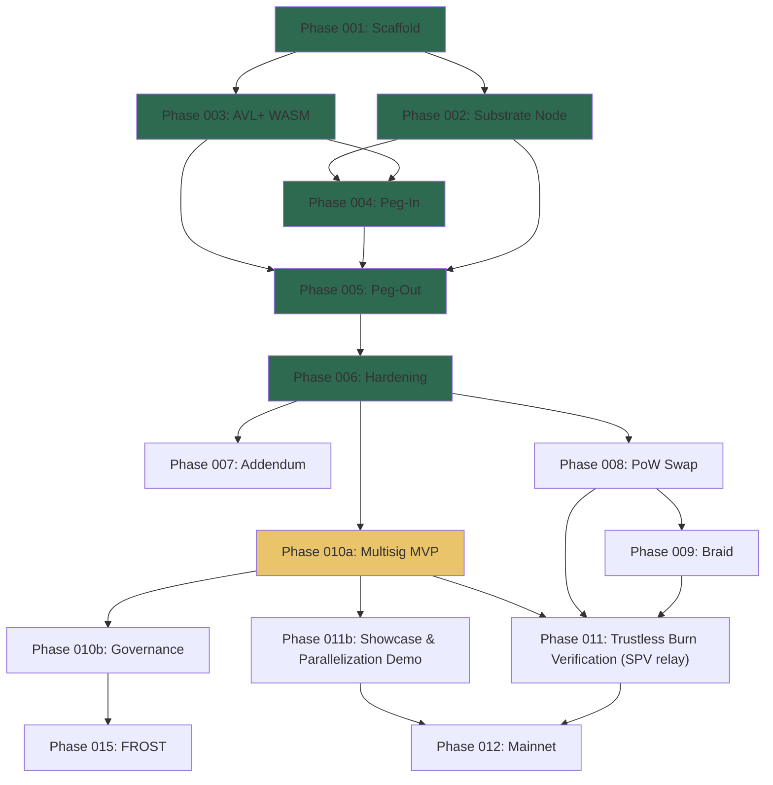

# Phase Index -- Ergo-Substrate Sidechain Bridge

> **Ultimate objective**: Build an institutional-grade Ergo sidechain bridge and
> reference stack strong enough for a major exchange, Base-class ecosystem team,
> or large application-chain operator to use as the foundation for its own
> Ergo-settled sidechain.
>
> **Strategy**: Prove the bridge step by step, but never publish or market it as
> production-ready for mainnet. The only production-candidate claim this branch
> may eventually support is explicitly testnet-scoped, after the release gates in
> [Ultimate Bridge Objective](../docs/ultimate-bridge-objective.md) and
> [Ultimate Bridge Roadmap](../docs/ultimate-bridge-roadmap.md) are met.
>
> **Positioning**: Demonstrate why Ergo is a superior settlement layer for
> EVM/Substrate sidechains: eUTXO parallel settlement, AVL proofs, DataInputs,
> batched exits, subblock-aware UX, and a credible path to L1-verifiable
> sidechain exit proofs.
>
> **Quality bar**: No known critical/high security issues, no unsafe signing
> modes, no unreproducible local patches, no hidden trust assumptions, no local
> secrets or runtime artifacts, and no performance claims without executable
> evidence.

---

## Current Critical Path

[Bridge Execution Plan](bridge-execution-plan.md) is the canonical continuation
queue. When work resumes with `continue`, use its active work package and
Definition of Done instead of selecting a new evidence or hardening slice from
the broader roadmap.

The bridge's strategic value is not simply that Ergo can host an EVM bridge.
It is delivering an auditable Ergo settlement stack with an explicit authority
model today while preserving the path to Ergo-verifiable sidechain exits.

Substrate/Frontier is the EVM-compatible execution layer and commitment
producer. It should emit or derive bridge-specific commitments that Ergo can
verify. It is not the final trust layer.

The current delivery plan has two explicit profiles:

1. **WP-06-FED:** complete the EIP-independent federated reference path. Its
   serial boundary is canonical tracker admission, then burn/checkpoint,
   global replay, external-fee payout and profile-specific recovery. This path
   may support a bounded federated reference package, never a trustless claim.
2. **WP-06-STARK / Phase 011 / Gate 5:** preserve the versioned,
   Blake2b/STARK-ready `bridge_event_root` / `burn_root` path and resume native
   on-chain verification when an activated compatible verifier exists. This is
   the Chain zeta / Phantom Burn closure path and the only route to a trustless
   claim.

Phase 008/009 consensus and `0x04` commitment work remain prerequisites to the
trustless profile, not blockers for the explicitly federated package. Phase
011b showcase and AVL lanes stay bounded as developer evidence and fallback
machinery.

Gate 6 governance readiness is not the Chain zeta fix.

Phase 011 is the Chain zeta / Phantom Burn closure path.

Phase 010b is governance hardening and release-readiness work. It can run in
parallel or after the burn-proof path, but it is not the cryptographic blocker
for Chain zeta unless a concrete release validator row is being closed.

### P0 Safety Blockers Before Gate 5

The historical PoC exposed two solvency-breaking timeout paths. WP-01 and WP-02
now contain them in source, while deployment activation and immutable legacy
inventory remain open. Those cutover boundaries still take priority over
showcase work, governance expansion, and release-evidence refreshes:

1. **Refundable deposit after mint**: old MCL/daemon code minted without first
   consuming the refundable source. MCL v3 now requires a confirmed transition
   to the canonical V2 vault before mint; activation evidence remains open.
2. **Payout after a reverted burn**: immutable v1 MCU boxes remain spendable by
   third parties through their old permissionless normal or timeout paths. New
   legacy creation/spend is disabled, the replacement source is transitional
   committee-authorized with no timeout, and every discovered old UTXO remains
   quarantined. A separate manifest-bound tool now verifies the caller-supplied
   expected digest, coherent network/checkpoint/address/ErgoTree bindings,
   synchronized indexes, distinct stable source agreement, a bounded checkpoint
   depth/age window, complete pagination, and a zero-UTXO observation. The
   reviewed historical manifest, authenticated approval, independently operated
   source provenance, and real network observations are still required. The
   tool cannot authorize cutover or prove the human coverage claim, independent
   source operation, or canonical consensus by itself.

The required peg-in sequence is:

`refundable deposit -> confirmed Ergo consume -> non-refundable settlement vault -> mint`

Until Gate 5 supplies an Ergo-verifiable burn and finality proof, every legacy
MCU payout path must remain fail-closed or committee-authorized after fresh burn
revalidation. A timeout may return liquidity to a settlement vault under the
declared transitional trust model; it must not pay the beneficiary merely
because time elapsed.

The V2 proof-bound settlement contract is not globally trustless while the same
transaction also consumes committee-authorized `SPVTracker` and aggregate DUP
inputs. Trustlessness is a property of the conjunction of every input script.
Likewise, waiting for Ergo confirmations after an anchor proves only the age of
that Ergo anchor, not sidechain finality.

## Phase Overview

| Phase | Name | Goal | Status |
|-------|------|------|--------|
| **001** | Scaffold & Contracts | Deploy ErgoScript contracts to testnet + relayer skeleton | ✅ **Done** |
| **002** | Substrate Node Bootstrap | Frontier EVM sidechain running locally (Aura PoA) | ✅ **Done** |
| **003** | AVL+ WASM Crate | Adapt `reference-avl` for bridge KV operations + verify Scorex compat | ✅ **Done** |
| **004** | Relayer — Peg-In Flow | ERG lock → sERG mint (Ergo→Sidechain) | `[-]` PoC flow works; refundable-deposit-before-mint transition is unsafe and open |
| **005** | Relayer — Peg-Out Flow | sERG burn → ERG unlock (Sidechain→Ergo) | `[-]` PoC flow works; legacy permissionless payout paths remain unsafe after burn reorg |
| **006** | Integration & Hardening | Full round-trip prototype + WASM signer + attack-chain review | `[-]` Prototype demonstrated; two critical fail-open timeout paths remain open |
| **007** | Technical Addendum | Draft a gated testnet production-candidate architecture manual; validator/template/release-gate binding added; do not publish or use the claim until release gates pass | `[-]` In progress |
| **008** | PoW Consensus Swap | Replace Aura with sc-consensus-pow (SHA-256 → Autolykos v2) | `[ ]` Not started |
| **009** | Braid Merged Mining | Extension section injection via `SidechainsDataPrefix = 0x04` (kushti-confirmed 2026-05-06) + BraidAuxPow verification + EIP draft for sidechain commitment format | `[ ]` Not started |
| **010a** | On-Chain Multisig MVP | P0 containment for refundable-mint and stale-burn payout, plus `atLeast()` guards and remaining non-throwaway hardening. Full governance remains deferred. | `[-]` Critical timeout fixes open; other compile/eval hardening done |
| **010b** | Committee Governance | Governance hardening and release-readiness evidence: key rotation, member addition/removal, governance contract, and operator review. Not the Chain zeta cryptographic fix. | `[ ]` Parallel / deferred unless a release validator requires it |
| **011** | Trustless Burn Verification | SPV relay / burn proof path via versioned `bridge_event_root` / `burn_root` commitments under `0x04` extension-section keys. This is the Chain zeta full fix: Ergo verifies sidechain finality, burn inclusion, payout binding, and DUP replay binding before release. Raw Frontier/EVM receipt proof machinery is not the preferred final design; use a Blake2b/STARK-ready bridge-native commitment tree. | `[ ]` Trustless-profile critical path; externally blocked |
| **011b** | Showcase & Parallelization Demo | Package the prototype for external EVM/Substrate teams: subblock-ready monitoring, batch-vs-single benchmarks, bounded sharded eUTXO settlement demo, developer walkthroughs, and "what Ergo adds" material. AVL lanes are demo/fallback machinery, not the final high-throughput architecture if EIP-0045/STARK aggregate settlement becomes available. | `[-]` Bounded demo work only — docs/showcase/offline scripts done; no new legacy V1 live transport is planned |
| **012** | Mainnet Deployment | Out of scope for this branch; no mainnet migration or mainnet production-ready claim | `[ ]` Not started |
| **015** | FROST Threshold Signatures | 100+ validator committee via custom FROST ciphersuite | `[ ]` Deferred |

---

## Dependency Graph

## Architecture Decisions (Locked)

| Decision | Choice | Rationale |
|----------|--------|-----------|
| L1 chain | Ergo Testnet | Mainnet after Phase 012 |
| L2 consensus (PoC) | Aura PoA | Fast iteration, swap to PoW in Phase 008 |
| L2 EVM | Frontier (pallet-evm + pallet-ethereum) | MetaMask/Hardhat/Solidity compatibility |
| Relayer language | TypeScript (Fleet SDK + ethers.js) | Reuses production sequencer patterns |
| AVL+ engine | `ergo_avltree_rust` → WASM | Our Bounty #7 contribution, Scorex-compatible |
| Proof storage | Context extensions (Var) | 96KB TX limit, not 4KB box limit |
| Trust model (PoC) | Single relayer → Phase 010a on-chain multisig | FROST deferred to Phase 015 |
| Confirmation depth | 50 SC blocks (on-chain constant) | Requires contract redeploy to change |
| Signing engine | ergo-lib-wasm-nodejs (sigma-rust) | Fleet SDK Prover fails on register-based proveDlog |
| Multisig strategy | `atLeast(m, Coll(pk1..pkN))` | Rosen Bridge pattern, zero custom crypto |
| MCL escape | Unsafe in the current mint ordering | The refundable MCL box must be consumed into a non-refundable settlement vault before mint; elapsed time does not prove absence of minting |
| UX acceleration | Ergo subblocks as fast inclusion/failure signal; ordering blocks for economic finality | Keeps finality conservative while making bridge UX feel much faster |
| Scaling strategy | Batch first, then bounded sharded eUTXO state boxes and liquidity boxes | Demonstrates parallel settlement without needing production-scale infrastructure; do not overbuild lanes before the STARK path is decided |
| Next-gen scaling track | Native STARK / EIP-45 aggregate settlement, if available soon | Could replace inline per-exit ErgoScript verification with one public validity proof, using Ergo output fanout more directly. Privacy can remain optional. |
| Developer audience | EVM/Substrate teams | Solidity/Frontier remains familiar; ErgoScript/eUTXO complexity is packaged into contracts, builders, scripts, and docs |

---

## Prototype Showcase Objectives

This repository is no longer just a bridge PoC. It should become a reference implementation that shows large ecosystem teams how to deploy a sidechain on Ergo without first becoming ErgoScript/eUTXO specialists.

| Objective | What the prototype must show | Current / planned proof |
|-----------|------------------------------|--------------------------|
| EVM developer familiarity | Apps can run on a Substrate/Frontier sidechain while users interact with familiar Solidity/EVM tooling | Phase 002 + ErgoBridge.sol peg-in/peg-out flow |
| Ergo as settlement layer | Ergo L1 can hold the canonical bridge state, liquidity, replay protection, and tracker roots | SCS, MCL, DUP, SPVTracker, aggregate settlement contracts |
| eUTXO parallelization | Throughput scales by splitting state across independent boxes instead of forcing every flow through one account/global lock | Spike 11 batch path done; sharded DUP/liquidity boxes remain for Phase 011b |
| Proof-friendly state | Large off-chain state can be committed on-chain with small AVL proofs | WASM AVL crate, DUP trees, SPV tracker, batch proofs |
| Subblock-ready UX | The bridge can react quickly to inclusion/failure once Ergo subblocks are available, while still waiting for ordering-block depth for high-value finality | Phase 011b monitoring/benchmark work |
| Trust roadmap | Start with local signer / committee multisig as a bounded prototype guard, then move directly to SPV relay / burn proofs once sidechain consensus and commitments are verifiable | Phase 010a minimum + Phase 008/009 -> Phase 011 |
| STARK-ready roadmap | If EIP-45 lands quickly, large public exit batches should move from inline AVL/ErgoScript verification to native STARK aggregate proofs | Deferred future track; keep AVL lanes as current working fallback/showcase |
| Honest tradeoff story | Ergo offers differentiated settlement primitives, not Ethereum/Base-level liquidity or tooling today | Technical Addendum + showcase docs |

---

## Files

| File | Description |
|------|-------------|
| [bridge-execution-plan.md](bridge-execution-plan.md) | Canonical autonomous continuation queue, large work packages, agent routing, verification, and institutional-reference exit criteria |
| [implementationplan001.md](implementationplan001.md) | Phase 001 detailed plan |
| [walkthrough001.md](walkthrough001.md) – [walkthrough001d.md](walkthrough001d.md) | Phase 001: Scaffold, audit, NFTs, AVL, signing |
| [walkthrough002.md](walkthrough002.md) – [walkthrough002d.md](walkthrough002d.md) | Phase 002: Substrate compilation, runtime, EVM, Solidity |
| [walkthrough003.md](walkthrough003.md) | Phase 003: AVL+ WASM crate |
| [walkthrough004.md](walkthrough004.md) | Phase 004: E2E Peg-In (ERG → sERG) |
| [walkthrough005.md](walkthrough005.md) | Phase 005/006: Mempool hardening & SCS oracle fix |
| [walkthrough006.md](walkthrough006.md) | Phase 005/006: E2E Peg-Out (sERG → ERG) |
| [walkthrough007.md](walkthrough007.md) – [walkthrough018.md](walkthrough018.md) | Phase 006: 12 audit rounds (82 findings) |
| [walkthrough019.md](walkthrough019.md) | Phase 006: Composite Attack Chains α-ε |
| [walkthrough020.md](walkthrough020.md) | Phase 006: Composite Attack Chains ζ-κ |
| [walkthrough021.md](walkthrough021.md) | Phase 006: Defense implementation sprint |
| [walkthrough022.md](walkthrough022.md) | Phase 006: MCL v2 deployed, full cycle verified, FINAL |
| [walkthrough023.md](walkthrough023.md) | Phase 011a: Spike 11 — Multi-claim batch settlement (commit `76a5f44`) |
| [walkthrough024.md](walkthrough024.md) | Prototype showcase roadmap — Ergo settlement advantages, subblocks, eUTXO parallelization, EVM/Substrate developer path |
| [../docs/evm-developer-showcase.md](../docs/evm-developer-showcase.md) | EVM developer-facing narrative: what stays familiar, what Ergo adds, and how the open-source kit hides the hard parts |
| [implementationplan011b.md](implementationplan011b.md) | Phase 011b executable plan — docs, benchmark script, proof inspector, sharded lanes design |
| [phase011b-claude-handoff.md](phase011b-claude-handoff.md) | Claude execution handoff for Phase 011b |
| [../docs/sidechain-on-ergo-in-one-afternoon.md](../docs/sidechain-on-ergo-in-one-afternoon.md) | Step-by-step EVM developer walkthrough for the bridge |
| [../docs/sharded-settlement-lanes.md](../docs/sharded-settlement-lanes.md) | Sharded DUP + liquidity lanes scaling design note |
| [../docs/subblock-ready-finality-model.md](../docs/subblock-ready-finality-model.md) | Subblock-aware finality model for bridge UX |
| [../docs/evm-integration-checklist.md](../docs/evm-integration-checklist.md) | EVM team integration checklist |
| [walkthrough025.md](walkthrough025.md) | Historical, superseded V1 batch demo record; non-executable after legacy transport retirement |
| [phase011b-sharded-lanes-handoff.md](phase011b-sharded-lanes-handoff.md) | Handoff for the minimal 2-lane sharded settlement spike |
| `relayer/src/scripts/sidechain-demo-preflight.ts` | Read-only sidechain preflight (Frontier RPC, deployed Solidity, eth_getCode) |
| `relayer/src/scripts/demo-readiness.ts` | Combined Ergo + sidechain readiness check with next-action guide |
| [walkthrough026.md](walkthrough026.md) | Historical V1 batch attempt and 0x0401 blocker analysis; non-executable |
| `relayer/src/scripts/anchor-preflight.ts` | Read-only 0x0401 extension field scanner — bridges batch preflight to anchor readiness |
| [phase011b-patched-devnet-handoff.md](phase011b-patched-devnet-handoff.md) | Historical patched-devnet V1 handoff; superseded and non-executable |
| `relayer/src/scripts/patched-devnet-readiness.ts` | Checks local prerequisites (ergo-source, sbt, java, env vars, node) for devnet e2e |
| `relayer/src/scripts/patched-devnet-plan.ts` | Prints a bounded patched-devnet diagnostic plan that stops before V1 signing or transport |
| `relayer/src/scripts/devnet-session-safety.ts` | Pre-run safety: inspects runtime files, prints backup/restore commands |
| `relayer/src/patched-devnet-env.ts` | Pure helpers for env var resolution and mismatch classification |
| `relayer/src/scripts/patched-devnet-go-no-go.ts` | Combined go/no-go checklist: prerequisites, env, network, backups, funding, signer alignment |
| `relayer/src/devnet-funding-preflight.ts` | Pure helpers for funding threshold classification and ERG formatting |
| `relayer/src/scripts/devnet-funding-preflight.ts` | CLI funding preflight: default no-secret blocked summary, public `--address` balance check, or explicit local `--include-secret-material` derivation |
| `relayer/src/devnet-signer-alignment.ts` | Pure helpers for config parsing, address derivation, alignment classification |
| `relayer/src/scripts/devnet-signer-alignment.ts` | CLI signer alignment: default no-secret blocked summary; verifies relayer signer matches mining address only after explicit local `--include-secret-material` opt-in |
| `relayer/scripts/devnet-session-env.template.ps1` | Shell-scoped env template for devnet sessions (no secrets) |
| `relayer/scripts/devnet-auto-env-from-node1.ps1` | Auto env: derives devnet-only session variables from node1 config after explicit local opt-in |
| `relayer/src/devnet-session-env.ts` | Pure helpers for session env validation (URL alignment, batch config, signer) |
| `relayer/src/scripts/devnet-session-env-check.ts` | CLI session env checker: verifies no-secret devnet env vars by default; signer/mining alignment requires explicit `--include-secret-material` in a local operator shell |
| `relayer/scripts/clear-devnet-session-env.ps1` | Cleanup script: removes all devnet session env vars after session |
| [walkthrough027.md](walkthrough027.md) | Historical patched-devnet go/no-go and failed V1 attempt record; non-executable |
| [walkthrough028.md](walkthrough028.md) | Historical patched-devnet checklist; superseded and non-executable after V1 transport retirement |

---

## Metrics

- **PoC Target**: ✅ **ACHIEVED** — Full round-trip Peg-In/Peg-Out on Ergo Testnet + local Substrate
- **Security Target**: **NOT MET** — the active PoC has known deposit-after-mint refund and reverted-burn payout traces. Chain zeta remains off-chain only. P0 containment plus Phase 011 are required before any trustless or production-candidate claim.
- **Infrastructure**: `[-]` WASM hybrid signer and DUP heartbeat are implemented; MCL/MCU timeout semantics require redesign before they can count as safety mechanisms.
- **Spike 11**: ✅ Multi-claim batch settlement validated offline/spike only (unlock: 10 claims, DUP: 20 burn IDs). SPVTracker ErgoTree changed (guarded token access). Single-claim fallback retained.
- **Legacy batch daemon path**: **RETIRED** — the offline batch spike remains useful diagnostic evidence, but every new legacy V1 daemon, CLI, programmatic signing, authorization, submission, and broadcast route is physically absent. Historical confirmation and recovery remain for already-submitted transactions. This does not retire historical on-chain V1 authority or close Gate 5.
- **Showcase target**: `[-]` Phase 011b — docs, offline benchmark, proof inspector, sharded lanes design committed. Live batch demo attempted 2026-05-09: Ergo preflight PASS, Frontier PASS, EVM deploy PASS, 2 peg-out burns created, daemon blocked on missing `0x0401` extension anchor. Resolution: patched devnet miner via `scripts/run-patched-ergo-devnet.ps1`. Funding path previously proven with a devnet-only node fixture (0.15 ERG minimum, 0.5 ERG comfortable).
- **Next engineering milestone**: execute the active package in [Bridge Execution Plan](bridge-execution-plan.md). The relayer can no longer initiate either unsafe legacy value-release route: owner mint and legacy aggregate payout transport are physically absent, while diagnostics and exact historical recovery remain. Authenticated V2 remains candidate/check-only. The next concrete Gate 5 milestone is a reviewed non-mainnet V4 cutover profile and package that binds application identity, external-fee conservation, global DUP lineage, exact target-node acceptance, and the activated finality parent. The real package-bound WP-06T11 `/transactions/check` exercise remains blocked until approved non-mainnet T9 inputs, both-chain recollection, and a compatible activated target node exist. WP-01 and WP-02 inventory work remains non-authorizing input to that cutover, not release evidence by itself.
- **Future scale track**: STARK / EIP-45 aggregate settlement is now explicitly tracked as the likely long-term way to break the inline verification cap. It should not block the current AVL batch demo, but it should prevent over-investing in lane complexity if native STARK verification becomes near-term.
